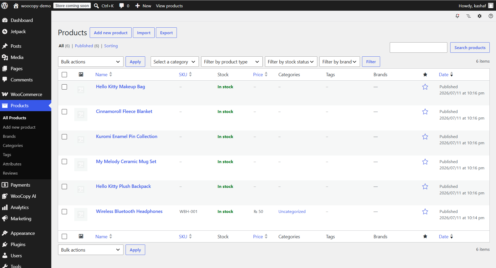
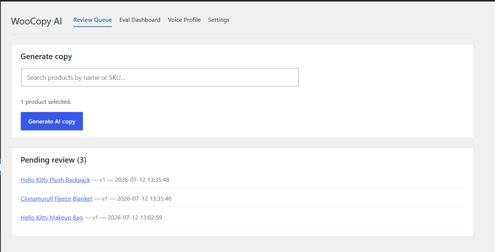
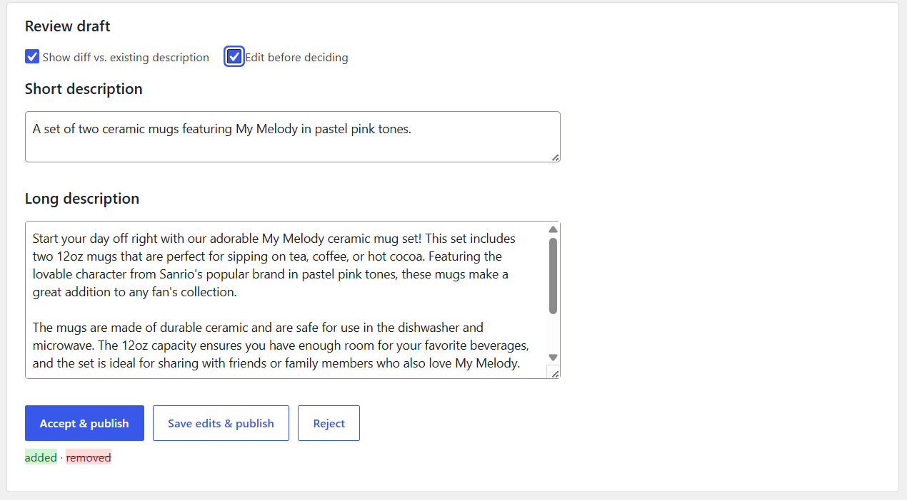
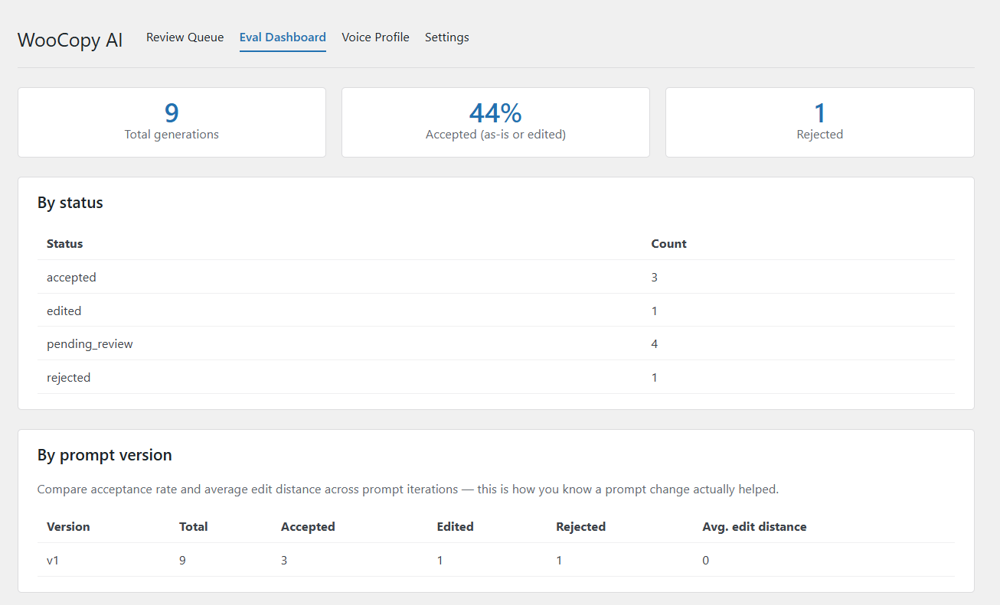
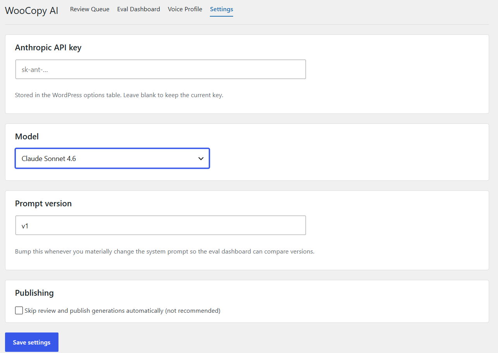
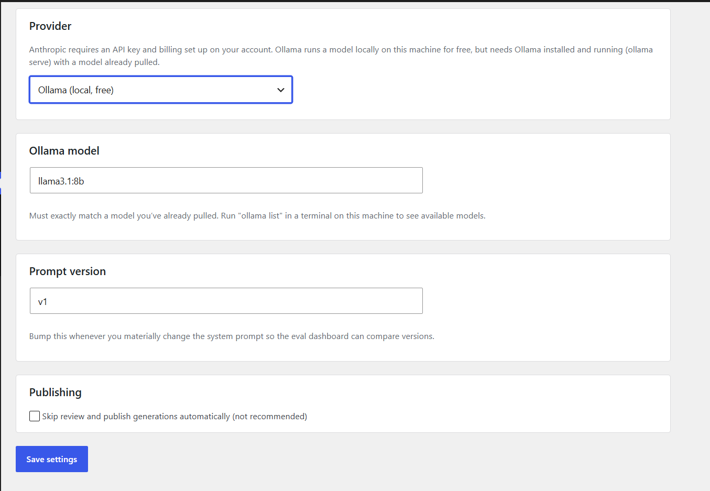
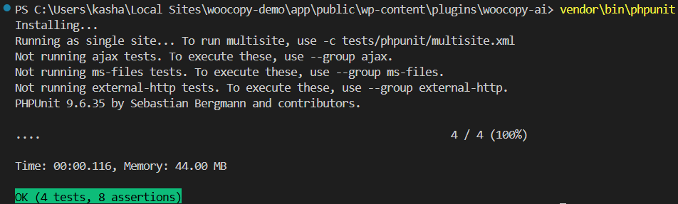

# WooCopy AI

AI-powered product copy generation for WooCommerce — built as an eval-first, human-in-the-loop system rather than a generate-and-forget gimmick.

## Why this exists

Most "AI product description" plugins are a text field and an API call. WooCopy AI treats AI-generated copy the way a production ML feature should be treated: every generation is logged, scored against a rubric, reviewed by a human before publishing, and tracked over time so you can tell whether your prompt changes are actually improving things.

## Core features

- **Eval-logging layer** — every generation writes a row to a custom `wp_woocopy_evals` table: prompt version, model, rubric scores (keyword coverage, length sanity, unsupported-claim flags), and — once reviewed — the human decision and edit distance between the draft and what was actually published.
- **Native WooCommerce data as context** — pulls real product attributes (SKU, categories, tags, variations, stock status, dimensions, existing descriptions) into the prompt instead of just a product title. Extensible via the `woocopy_ai_product_context` filter.
- **Brand voice consistency** — feed in 2-3 example descriptions you like; Claude extracts a reusable style profile (tone, sentence length, recurring phrases) that gets injected into every future generation.
- **Human-in-the-loop review UI** — a word-level diff view (old description vs. AI draft) with accept / edit / reject actions. Nothing publishes without a human decision unless you explicitly enable auto-publish.
- **Bulk generation with cost estimation** — select multiple products from the catalog, see an estimated token/time cost before committing, and generate with built-in rate-limiting/pacing.
- **Eval dashboard** — acceptance rate, average edit distance, and keyword coverage broken down by prompt version, so you can see whether prompt iteration is actually working.
- **WordPress coding standards compliant** — sanitized/escaped inputs and outputs throughout, REST nonces, capability checks (`manage_woocommerce` / `manage_options`), proper `wp_enqueue_script` usage, i18n-ready strings, and a proper `uninstall.php`.


## Screenshots

**Product catalog** - the demo WooCommerce store used for testing generations.



**Review queue** - select a product, generate AI copy, and see everything awaiting human review.



**Review draft** - word-level diff between the existing description and the AI draft, with accept / edit / reject.



**Eval dashboard** - acceptance rate, status breakdown, and per-prompt-version stats.



**Voice profile** - extracted brand tone/style from example descriptions, applied to every future generation.

.png)

**Dual provider support** - switch between Claude (Anthropic API) and Ollama (free, local) per environment.





**Automated tests passing** - PHPUnit suite covering eval rubric scoring, table creation, and review workflow.



## Requirements

- WordPress 6.3+
- WooCommerce (active)
- PHP 8.0+
- An Anthropic API key

## Setup

1. Copy (or zip and upload) the `woocopy-ai/` folder into `wp-content/plugins/`.
2. Activate **WooCopy AI** from the Plugins screen (this creates the `wp_woocopy_evals` table).
3. Go to **WooCopy AI ? Settings** and add your Anthropic API key.
4. (Optional but recommended) Go to **WooCopy AI ? Voice Profile** and paste 2-3 example descriptions that already sound like your brand.
5. Go to **WooCopy AI ? Review Queue**, search for a product (or select several for bulk generation), and click **Generate AI copy**.
6. Review the diff, accept / edit / reject, and check **WooCopy AI ? Eval Dashboard** to see aggregate stats.

You can also trigger generation directly from the **Products** list — there's a "Generate AI copy" row action and a matching bulk action in the dropdown.

## Development (admin React app)

The admin UI lives in `admin/src` and is built with `@wordpress/scripts`.

```bash
cd admin
npm install
npm run start   # dev build with watch
npm run build   # production build into admin/build
```

The compiled bundle in `admin/build/` is what actually ships and is what's already included in this zip — you don't need Node installed just to run the plugin, only to modify the React app.

## Architecture

```
woocopy-ai/
+-- woocopy-ai.php                        # Bootstrap: activation, autoloader, hooks
+-- uninstall.php                         # Cleanup on plugin deletion
+-- includes/
¦   +-- class-woocopy-plugin.php          # Admin menu, asset enqueueing, Products list integration
¦   +-- class-woocopy-api.php             # Anthropic API wrapper (generation + voice extraction)
¦   +-- class-woocopy-product-data.php    # Structured WooCommerce product context builder
¦   +-- class-woocopy-voice-profile.php   # Brand voice storage/extraction
¦   +-- class-woocopy-eval.php            # Eval table schema, logging, rubric scoring, dashboard queries
¦   +-- class-woocopy-rest-controller.php # REST API consumed by the React app
¦   +-- class-woocopy-settings.php        # Settings API registration/sanitization
+-- admin/
¦   +-- src/                              # React/TypeScript source
¦   +-- build/                            # Compiled bundle (ships as-is)
+-- tests/
    +-- test-eval-rubric.php              # PHPUnit smoke tests for rubric scoring
```

## Eval rubric (v1)

Each generation is scored automatically at creation time:

- **Keyword coverage** — fraction of the product's own name/category/tag terms that appear in the generated copy.
- **Length sanity** — short description 5-40 words, long description 40-400 words.
- **Unsupported claims** — flags risky superlatives ("best", "world-class", "guaranteed", etc.) for human attention.

Once a human reviews a draft, the table also records the decision (accepted / edited / rejected) and, for edits, the Levenshtein edit distance between the AI draft and what was actually published — the real signal for whether the model is saving time or creating more work.

## License

GPL v2 or later, consistent with WordPress plugin directory requirements.
